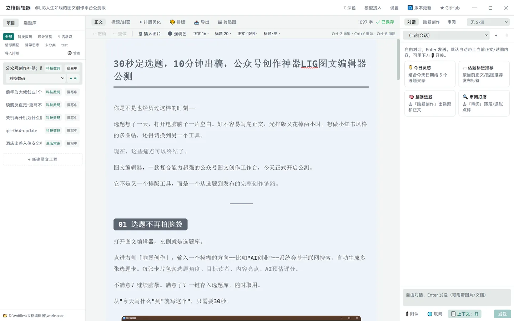
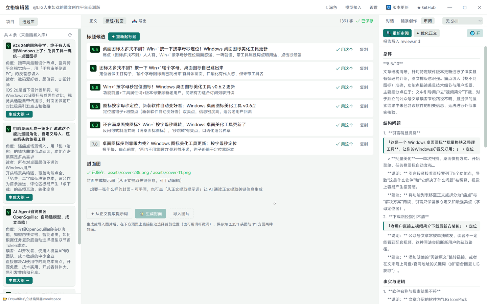
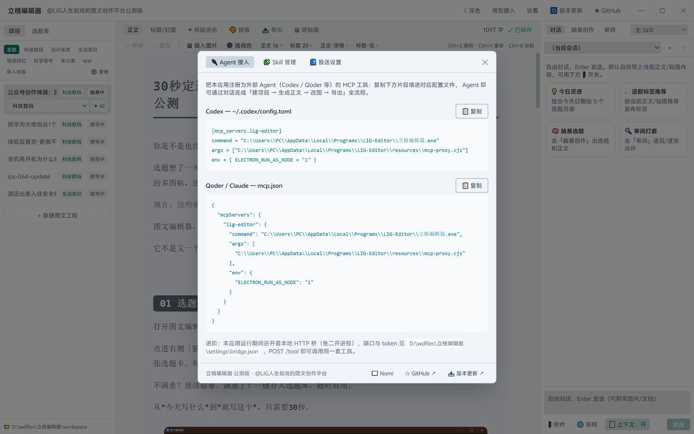
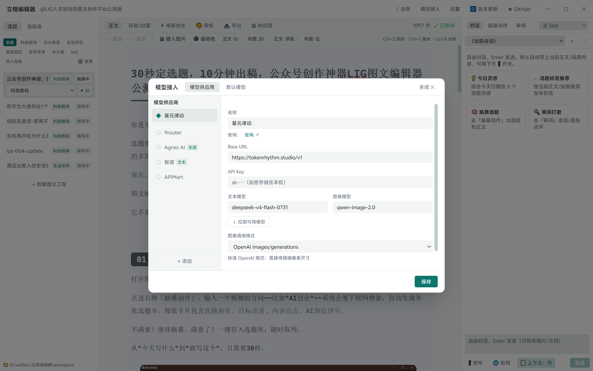
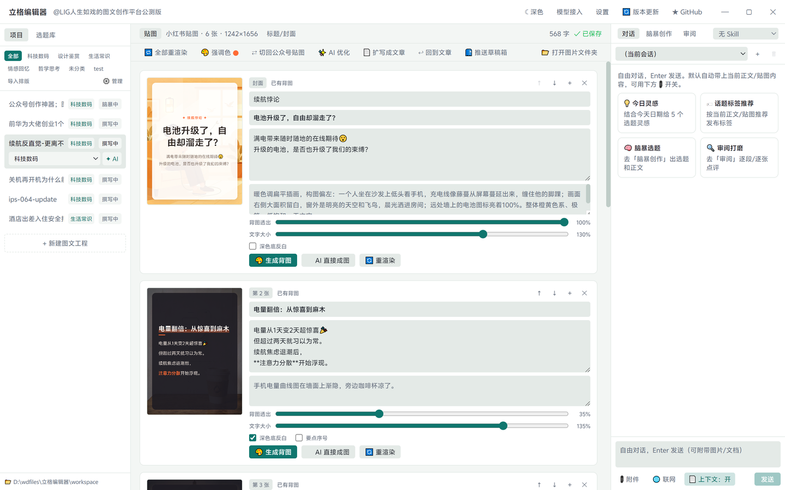
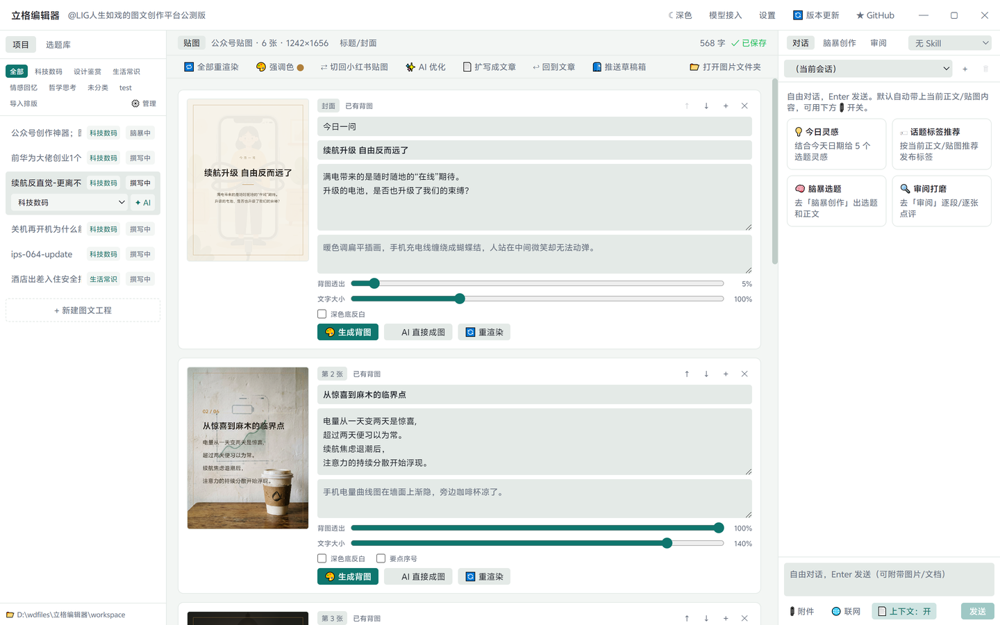
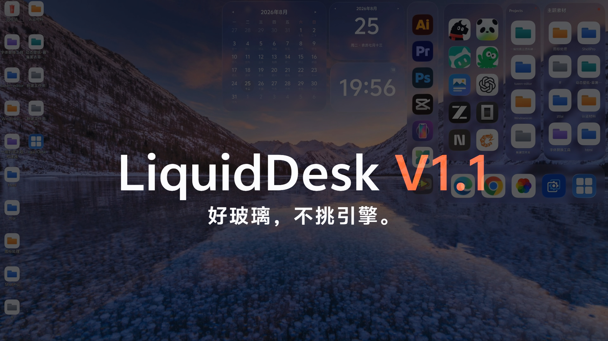

# 立格编辑器（LIG-Editor）

> 本地优先的公众号图文创作工作台 · @LIG人生如戏

🌐 **品牌官网**：[LIG 立格 Studio](https://ligdesign.win/) —— 设计 · 工具 · 桌面美学

一个 **Windows 桌面应用**（Electron），把公众号图文创作全链路——脑暴选题、AI 初稿、逐段修改、审阅把关、配图封面、标题打磨、排版导出——收进同一个工作台。

## 界面一览

<p align="center">
  
</p>
<p align="center"><sub>三栏工作台 · 选题库与审阅 · Agent MCP 接入 · 开放模型接口 · 小红书贴图 · 公众号贴图</sub></p>

<details>
<summary>📸 查看全部高清截图</summary>
<br>

| 三栏工作台（主界面） | 选题库 ＆ 标题 / 审阅 |
| :---: | :---: |
|  |  |
| **Agent MCP 接入（WorkBuddy 等）** | **开放模型接口** |
|  |  |
| **小红书贴图** | **公众号贴图** |
|  |  |

</details>

## 特性

- **本地优先**：工程、素材、密钥全在本机，不上传任何内容到自有服务器
- **md 直开**：双击 .md 文件 / 把它拖到应用图标直接打开（已在 workspace 内则定位到对应工程，外部 md 自动导入为新工程；portable 版首次使用需「打开方式」指定一次 exe）
- **AI 副驾驶**：右侧对话面板驱动全流程，接入任意 OpenAI 兼容 API，Skill 体系挂载写作风格
- **Agent 可操控**：MCP + 本地 HTTP 桥，外部编程 Agent（Codex / Qoder 等）可直接操控编辑器
- **三栏工作台**：左栏工程列表 · 中栏所见即所得编辑器（TipTap）· 右栏 AI 副驾驶
- **三种配图管线**：代码绘图（HTML→PNG）、AI 文生图、真图抠图，产物统一进 `assets/`
- **一键推送公众号**：正文本地图片自动上传微信 CDN，草稿直推公众号后台
- **版本更新提醒**：启动静默检测 + 顶栏手动检查，新版本弹窗直达夸克/百度/GitHub 下载（双更新源：官网 update.json + GitHub Release）
- **排版主题**：6 套分类预设调性，标题装饰（胶囊/下划线等）、小节序号（01/一、/① 圈号等 6 种）、引用/分隔线/加粗形态、背景色逐项自选，支持导入公众号排版自定义

## 下载

[📥 最新版本下载（夸克网盘）](https://pan.quark.cn/s/1cb400aa407b) [📥 最新版本（百度网盘）](https://pan.baidu.com/s/1Y1tbciVySYOEd2gcwivqrw?pwd=35c8)
· [⭐ 最新版本 GitHub Release](https://github.com/Samuel5945/LIG-Editor/releases/latest)

## 技术栈

| 层 | 技术 |
|---|---|
| 桌面框架 | Electron 31 |
| 前端 | React 18 + Vite 5 + Tailwind CSS 3 |
| 富文本编辑器 | TipTap（ProseMirror） |
| 图像处理 | sharp + 自研抠图算法 |
| 代码绘图 | Electron offscreen BrowserWindow（HTML→PNG） |
| MCP | `@modelcontextprotocol/sdk`（stdio + 本地 HTTP） |
| 文件监听 | chokidar（工程文件热载） |

## 开发

```bash
cd app
npm install
npm run dev      # 启动开发模式（热重载）
npm run build    # 仅构建
npm run dist     # 构建 + 打包 Windows 安装包
```

## 发版

bump `app/package.json` 版本号 → `npm run dist` → 上传夸克/百度网盘 → 发 GitHub Release（**正文必须贴网盘链接**）→ 最后更新官网 [lig-editor-update.json](docs/site/lig-editor-update.json)（这步完成，用户端更新提醒才上线）。详见 [docs/release.md](docs/release.md)。

## 架构

```
┌─ Electron 主进程 ───────────────────────────────┐
│ · 工程文件存储 + chokidar 热载                    │
│ · 模型调用代理（OpenAI 兼容，流式转发）            │
│ · MCP 能力核（stdio + 本地 HTTP/SSE）             │
│ · offscreen 渲染器（figures/*.html → assets/*.png）│
│ · 图像处理（抠图/裁切/封面合成）                   │
│ · 密钥 DPAPI 加密存储（safeStorage）               │
└───────────────────────┬────────────────────────┘
                     IPC
┌─ 渲染进程：三栏工作台 ─┴──────────────────────────┐
│ 左栏           │ 中栏               │ 右栏        │
│ 项目列表        │ 富文本编辑器        │ AI 副驾驶    │
│ 选题库          │ (TipTap 所见即所得   │ 对话面板     │
│ 素材/配图树    │  公众号内联样式预览)  │ 指令→diff→  │
│ Skill 管理     │ 标题/封面工作区      │  确认应用)   │
└──────────────────────────────────────────────────┘
```

## License

Apache-2.0 © Samuel Shi

## 参考项目

- [Nomi](https://github.com/aqm857886159/Nomi) — 本地优先 + AI 副驾驶 + 无头能力核，本项目为其"图文版"适配

## 个人其他作品

<p align="center">
  <a href="https://www.bilibili.com/video/BV14r8d6mEcp/?share_source=copy_web&vd_source=2ed777ce01c157b46368695126a8ecca">
    
  </a>
</p>
<p align="center">
  <b><a href="https://www.bilibili.com/video/BV14r8d6mEcp/">LiquidDesk V1.1</a></b> · 好玻璃，不挑引擎。 —— Windows 桌面玻璃拟态美化工具<br>
  <sub>▶ 点击封面前往 B 站观看演示</sub>
</p>
